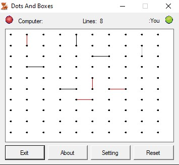

# Dot Game (Dots and Boxes)

## Overview
Dot Game is a classical "Dots and Boxes" game implemented in C#.Net. Originally created in winter 2009, this project allows users to play the classic pen-and-paper game against the computer.

## Rediscovery and Sharing
I recently stumbled upon this project on my hard disk drive, a nostalgic find from the winter of 2009. Despite its age, I believe in the value of sharing old projects, and that's why I've decided to upload it to GitHub. Feel free to explore, use, and contribute to this piece of coding history.

🤟

